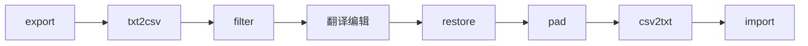

# 对话上下文摘要

从 `GO HELL GO 素材` 工作区转移而来，时间 2026-07-10。

## 产出

合并简化后的 UE4 本地化工具集脚本：
- `ue4_localization_toolkit.py` — 13 个脚本 → 1 个 CLI 工具

## 原始脚本清单（源工作区 `to/` 及根目录）

| 脚本 | 作用 |
|------|------|
| `extract_folder.py` | 扫描子文件夹，批量导出 .uasset 文本 |
| `extract.py` | 按文件清单导出 .uasset 文本 |
| `batch.py` | .txt(key=value) → .csv |
| `select.py` | 置空 Arg/Command/PageCtrl 行 |
| `restore.py` | 修复 Translator++ 导出 CSV（去引号、恢复空行） |
| `fix.py` | 用原始行补齐修复文件行数 |
| `csv2txt.py` | .csv → .txt(key=value) |
| `ready.py` | .txt 导入回 .uasset |
| `chou.py` | 复制 .txt+.uasset+.uexp 配对到目标目录 |
| `deletetxt.py` | 递归删除 .txt |
| `qu.py` | _NEW.uasset→.uasset, _NEW.uexp→.uexp |
| `list.py` | 生成 PAK 文件清单（../../../虚拟路径） |
| `analysis.py` | 补丁 vs 已翻译文件差异分析 |
| `findtext.py` | 在 .uasset/.uexp 中搜索文本（UTF-16-LE/UTF-8） |

## 完整工作流

## 配置参数

- 工具：`C:\Users\Boking Bow\Exe\PACKCRACK\UE4localizationsTool\UE4localizationsTool.exe`
- 常用源目录：`F:\Reason\Origin\GO HELL GO 素材\gohellgo`、`gohellgo_1_4`、`ChinesePatch_P`
- 执行环境：Windows 11，Python 3

## 已发现并修复的 bug

原 `extract.py` 计数行 `(ok + 1 if export_one(p) else fail + 1)` 只计算不赋值（表达式而非语句），已修正为 `if export_one(p): ok += 1 else: fail += 1`

## 记忆存储位置

`C:\Users\Boking Bow\.claude\projects\f--Reason-Origin-GO-HELL-GO---\memory\` — 当前空，无已有记忆。
